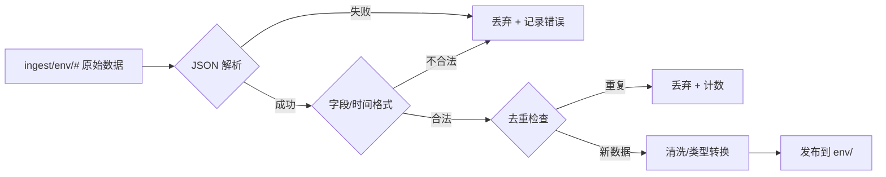
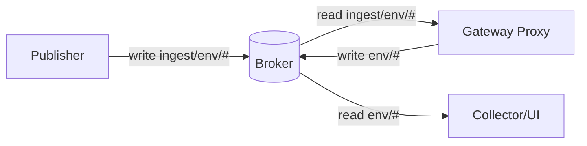

# 《物联网应用基础》期末项目实验总结（A 模块：MQTT Broker + Gateway Proxy）

## 一、个人负责内容与定位
我负责 A 模块（MQTT Broker + Gateway Proxy），属于系统的网络层核心：
- 部署并配置 MQTT Broker（Eclipse Mosquitto），提供稳定的消息转发；
- 配置账号与 ACL 权限，落实最小权限原则；
- 实现 Gateway Proxy，对原始数据进行验证、清洗、去重并转发。

这一模块决定了整条链路的数据入口质量、权限隔离与运行稳定性。

---

## 二、实现细节与关键技术

### 1. MQTT Broker 部署与配置
使用 Mosquitto，监听 `0.0.0.0:1883`，禁用匿名连接，启用密码认证与 ACL 控制。

核心配置示例（`mosquitto-system.conf` 关键片段）：

```properties
listener 1883 0.0.0.0
allow_anonymous false
password_file /etc/mosquitto/password_file
acl_file /etc/mosquitto/acl
persistence true
persistence_location /var/lib/mosquitto/
log_dest file /var/log/mosquitto/mosquitto.log
log_dest stdout
```

账号与权限角色：
- `publisher`：只能发布 `ingest/env/#`
- `proxy`：订阅 `ingest/env/#` + 发布 `env/#`
- `collector`：只能订阅 `env/#`
- `admin`：全权限（调试）

ACL 示例（思想）：

```text
user publisher
topic write ingest/env/#

user proxy
topic read ingest/env/#
topic write env/#

user collector
topic read env/#
```

这样保证了发布端无法直接写入清洗后的正式主题，避免绕过网关。

### 2. Gateway Proxy 数据处理流程
Proxy 作为 MQTT 客户端连接 Broker，订阅 `ingest/env/#`，完成数据治理后发布到 `env/#`。

处理逻辑要点：
1. **JSON 校验**：必须是 JSON object；
2. **字段验证**：包含 `ts` 和 `value`；
3. **时间格式**：ISO8601；
4. **指标白名单**：只允许 temperature / humidity / pressure；
5. **清洗**：空字符串 → `null`，数字字符串 → float；
6. **去重**：基于 `(metric, ts)` LRU/TTL 去重；
7. **转发**：发布到 `env/<metric>`。

流程图（Mermaid）：



### 3. 数据去重策略（设计思路）
去重逻辑避免重复入库，也降低下游负担。思路：
- 使用 LRU 缓存保存近期 `(metric, ts)`；
- 命中则丢弃；
- 过期自动淘汰。

伪代码示例：

```python
if cache.contains((metric, ts)):
    drop()
else:
    cache.put((metric, ts))
    forward()
```

### 4. Proxy 消息清洗细节示例
（简化示例，体现数据治理思路）

```python
payload = json.loads(msg.payload.decode("utf-8"))
if "ts" not in payload or "value" not in payload:
    return

value = payload["value"]
if value == "":
    value = None
else:
    value = float(value)

cleaned = {"ts": payload["ts"], "value": value}
client.publish(f"env/{metric}", json.dumps(cleaned))
```

### 5. 部署角色与主题隔离关系
通过账号+ACL 保证“发布端只能写 ingest，订阅端只能读 env”。  



---

## 三、遇到的技术难点与解决方式

### 1. ACL 配置与权限误配置
**问题**：初期订阅/发布出现权限错误，尤其是 Proxy 需要读写不同主题，导致 “订阅成功但发布被拒绝” 的现象。  
**解决**：把角色权限拆分清楚，并用 `mosquitto_pub/sub` 对每个账号逐条验证。最终固定为“发布端→ingest、Proxy→ingest+env、Collector→env”。  
**经验**：如果 Broker 只报 `Not authorized`，优先检查 ACL 顺序与通配符（`#` 是否匹配层级）。

### 2. 原始数据格式不稳定
**问题**：传感器数据文件里存在空字符串与异常值，直接进入下游会引发解析或数据库错误。  
**解决**：将清洗逻辑前置到 Proxy，统一处理空值、类型转换，减少 Collector 的异常处理压力。  
**细节**：空字符串统一转 `null`，下游统计时用 `COUNT(value)` 与 `COUNT(*)` 的差值表示缺失。

### 3. 重复数据处理
**问题**：重复消息可能导致 SQLite UNIQUE 约束冲突或统计偏差。  
**解决**：在 Proxy 层做去重，避免重复消息进一步传播。  
**细节**：去重以 `(metric, ts)` 为键，保证同一时间点数据只进入一次，避免 “重发” 造成重复插入。

### 4. 网络抖动导致的断连
**问题**：在局域网环境中偶发断连会导致 Proxy/Publisher 短暂停发。  
**解决**：在客户端设置自动重连逻辑，并通过 Broker 日志确认断连原因；必要时提高 keepalive 或在 UI 侧提示重试。  
**收获**：MQTT 稳定性不仅靠代码，还依赖网络与 Broker 配置。

---

## 四、个人收获与思考

1. **理解了 MQTT 工程级部署**  
不只是“能用”，还要考虑认证、权限、日志、持久化等真实场景需求。  
例如 ACL 与两层 Topic 设计是“防止脏数据进入核心链路”的工程手段。

2. **系统分层设计价值明显**  
Proxy 统一清洗后，下游逻辑更简化，扩展性更好。  
例如后续新增指标只需要在 Proxy 白名单与下游表结构里扩展即可，不必修改 Publisher/Collector 核心逻辑。

3. **数据质量治理是关键**  
在入口过滤脏数据，是实际物联网系统的重要实践。  
我意识到“允许 null”与“数据缺失统计”的设计非常重要，避免把缺失当 0 造成误判。

4. **联调意识提升**  
一个 ACL 或 Broker 配置问题就能让整条链路失效，必须建立逐层验证和日志排查习惯。  
我形成了“先用 mosquitto_pub/sub 验证通路，再启动系统”的联调流程，效率明显提高。

5. **系统可观测性意识增强**  
Proxy 输出简洁的处理日志（通过/丢弃/去重），能快速定位问题阶段，避免“下游报错但源头不明”。

---

## 五、后续可优化方向
- 将指标白名单、去重窗口改为可配置（如 `.env` 或 JSON），便于新增指标无需改代码；
- 输出统计指标（错误数、去重率、空值率）便于监控，配合日志可做健康检查；
- Proxy 增加批量转发或缓冲策略提升高频场景性能，降低网络和 Broker 压力；
- Proxy 增加“异常样本落盘”选项，便于课后复盘数据质量问题。

---

## 六、总结
A 模块是系统“消息枢纽 + 数据门禁”。通过 Mosquitto 的权限控制与 Gateway Proxy 的校验清洗，我不仅实现了可靠的数据流转，还对 MQTT 在工程中的安全性与可维护性有了更深刻的理解。  
从实际落地来看，权限隔离、数据清洗和去重都直接影响下游稳定性与统计结果的可信度，这也让我更清楚“数据入口治理”在物联网系统中的价值。
