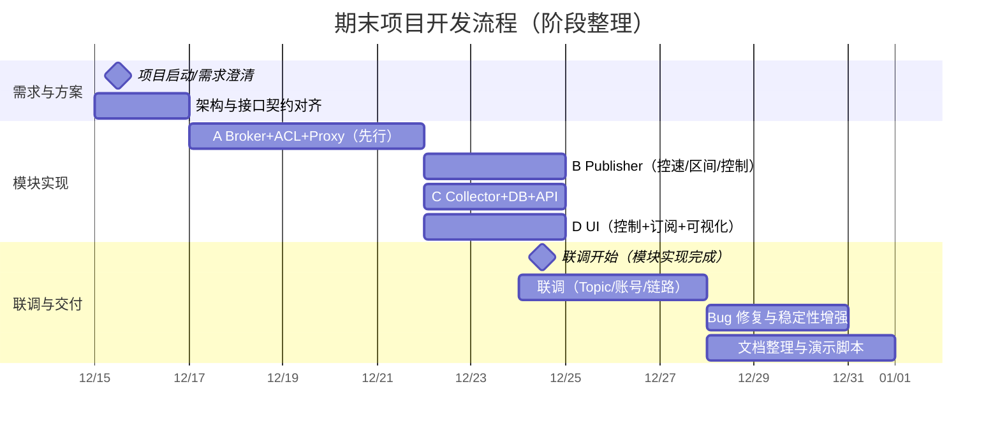
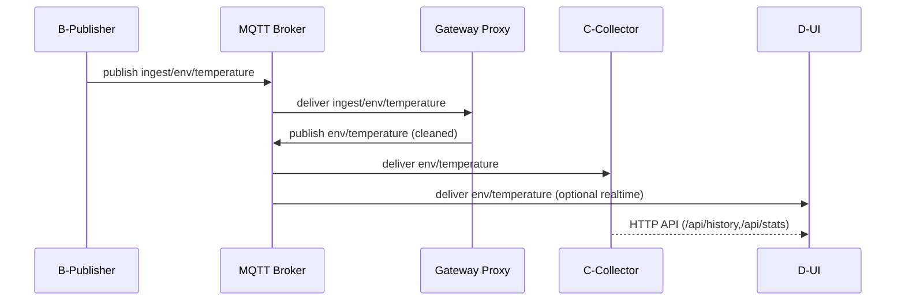

# 《物联网应用基础》期末项目小组讨论记录（整理版）

> 说明：本文为小组在整个开发周期中的讨论要点与决策的“整理版记录”，用于期末提交的过程材料归档。内容按阶段+会议纪要形式组织，覆盖需求澄清、架构设计、接口契约、实现联调与问题闭环等关键过程。

## 0. 基本信息

- 项目题目：环境监测数据采集与分析处理系统（MQTT 发布/订阅 + 清洗入库 + GUI 展示）
- 小组成员与分工：
  - 朱会佳：A 模块（MQTT Broker + Gateway Proxy）
  - 邱婉盈（组长）：B 模块（Publisher）
  - 谢文轩：C 模块（Collector + SQLite + FastAPI API）
  - 孙凯文：D 模块（PyQt5 GUI + 可视化）
- 代码仓库结构：`A-deploy/`、`B-publisher/`、`C-collector/`、`D-ui/`、`docs/`、`项目说明文档.md`

---

## 1. 讨论产物总览（在开发前先对齐）

### 1.1 关键接口契约（最终版）

- MQTT Broker：`<broker_host>:1883`（支持用户名密码认证）
- Topic 分层：
  - 原始层：`ingest/env/<metric>`（B 发布，A-Proxy 订阅）
  - 清洗层：`env/<metric>`（A-Proxy 发布，C/D 订阅）
- metric 白名单：`temperature | humidity | pressure`
- MQTT payload（统一 JSON，UTF-8）：

```json
{"ts":"YYYY-MM-DDTHH:MM:SS","value": number|null}
```

- C 模块 HTTP API（D 调用）：
  - `GET /api/realtime?metric=<metric>&limit=<N>`
  - `GET /api/history?metric=<metric>&from=<ISO>&to=<ISO>`
  - `GET /api/stats?metric=<metric>&from=<ISO>&to=<ISO>`

### 1.2 权限与账号（最终版）

- `publisher`：只写 `ingest/env/#`
- `proxy`：读 `ingest/env/#`、写 `env/#`
- `collector`：只读 `env/#`
- `admin`：调试用全权限

---

## 2. 开发流程时间线（阶段视图）



> 注：日期为整理版示意，用于表达“先对齐、再并行开发、最后集中联调与文档收口”的流程结构。

---

## 3. 会议纪要（按阶段整理）

### 会议 1：需求澄清与总体方案（开发前）

**参会**：全员  
**目标**：读懂老师项目要求，确定必须交付的功能闭环与展示方式。

**讨论要点**：
- 必须实现 MQTT 发布/订阅；数据从文件模拟传感器；订阅端需要持久化并支持查询/统计；需要 GUI 展示。
- 老师提供的“网络结构建议图”核心是：Broker 独立、发布端/订阅端/数据处理端通过网络连接，物理部署可以分离。

**决策**：
- 采用四模块分工并行实现：A（Broker+网关）、B（发布）、C（采集+API）、D（GUI）。
- 数据链路必须能演示闭环：B 发送 → A 处理 → C 入库 → D 展示/查询。

**待办**：
- 组长牵头输出接口契约草案（Topic/payload/API）。
- A 先把 Broker 认证与 ACL 方案写出来，避免后期权限乱。

---

### 会议 2：接口契约冻结（Topic / payload / API）

**参会**：全员  
**目标**：冻结“跨模块接口”，确保四个模块能并行开发且最终能拼起来。

**讨论要点**：
- Topic 是否需要分层：一开始有人倾向“直接 env/<metric>”，但担心脏数据直达下游、权限不好控。
- payload 字段：尽量简化，保证 UI 和 DB 易处理。
- API 返回结构：D 端需要统一 points 列表，避免多种格式导致 UI 解析复杂。

**决策（最终版）**：
- Topic 分两层：`ingest/env/<metric>`（原始）→ `env/<metric>`（清洗后）。
- payload 统一 `{ts, value}`，`value` 允许为 `null` 表示缺失。
- C 的 API 统一返回 `{"metric": "...", "points": [{"ts": "...", "value": ...}, ...]}`；统计接口返回 count/missing/min/max/mean。

**待办**：
- A：实现 Proxy 的校验/清洗/去重策略，并确保只订阅 ingest 层避免循环转发。
- B：发布到 ingest 层；在本地读文件时把 `""` 转成 `null`。
- C：订阅 env/#，DB 采用 `UNIQUE(metric, ts)` 去重；实现 3 个 API。
- D：优先实现“订阅实时显示 + 调用 API 拉历史/统计”，发布端控制用 QProcess。

---

### 会议 3：A 模块方案评审（Broker/ACL/Proxy）

**参会**：朱会佳 + 邱婉盈（组长）+ 谢文轩（联调相关）  
**目标**：把“权限与网关”的边界讲清楚，减少后期联调扯皮。

**讨论要点**：
- ACL 最小权限：publisher 不应写 env/#，否则可以绕过 Proxy。
- Proxy 需要做哪些“必要而不过度”的数据治理：只做格式/字段/类型/时间校验与轻量去重，避免重业务逻辑。
- 日志与统计：Proxy 需要能输出 forwarded/dropped/duplicated，便于联调定位。

**决策**：
- 采用 4 账号模型（publisher/proxy/collector/admin），并提供对应 acl 文件。
- Proxy 订阅 `ingest/env/#`，发布 `env/<metric>`；只允许三类 metric；非法数据丢弃并打日志。
- 去重以 `(metric, ts)` 为键，LRU + TTL（防止缓存无限增长）。

**验收方式**：
- 先用 `mosquitto_pub/sub` 验证账号权限，再启动 Proxy；确认 Proxy 输出统计正常。

---

### 会议 4：B 模块控制协议与 D 对接（QProcess + stdin）

**参会**：邱婉盈（组长）+ 孙凯文  
**目标**：明确“GUI 如何控制发布端脚本”，避免 UI 写完发现控制不了。

**讨论要点**：
- 控制方式选型：直接在 UI 里写 MQTT 发布 vs UI 启动独立发布脚本。
- 需要哪些控制：开始、暂停、恢复、停止、动态改速率；是否需要时间区间过滤。
- 控制通道：stdin 命令易实现且平台通用；QProcess 适配 PyQt。

**决策**：
- B 保持为独立脚本 `publish.py`，UI 用 QProcess 启动；运行中通过 stdin 命令控制：
  - `pause` / `resume` / `rate N` / `stop`
- B 命令行参数：`--metric --rate [--start --end]`；start/end 为 ISO8601 字符串，按字符串比较筛选。

**风险提示与规避**：
- stdin 读取使用 `readline()`，命令必须带换行；日志输出需 `flush=True`，否则 UI 中显示延迟。

---

### 会议 5：C 模块数据模型与 API 语义对齐

**参会**：谢文轩 + 孙凯文 + 邱婉盈（组长）  
**目标**：确定 DB 表结构与 API 语义，确保 D 不需要理解 MQTT。

**讨论要点**：
- DB 设计：是否一张表存三类指标；如何去重；如何表示缺失值。
- API 的时间范围：from/to 是否必须；返回是否按时间排序。
- 统计口径：mean 是否排除 null；missing 如何计算。

**决策**：
- 单表 `measurements(metric, ts, value, received_at)`，对 `(metric, ts)` 做 UNIQUE。
- `value` 允许 NULL；统计接口 `missing = COUNT(*) - COUNT(value)`；mean/min/max 基于非空值。
- API 返回 points 按 `ts ASC`，UI 直接用 ts 画图。

---

### 会议 6：第一次全链路联调（B→A→C→D）

**参会**：全员  
**目标**：跑通最小闭环，定位“链路断点”并形成排查手册。

**联调步骤**：
1. 启动 Broker（含账号/ACL）
2. 启动 Proxy（订阅 ingest 层）
3. 启动 Collector（订阅 env/# 入库）
4. 启动 UI（订阅或调 API）
5. 启动 Publisher（发布 ingest/env/<metric>）

**发现的问题（典型）**：
- Topic 不匹配导致“订阅端没数据”：Publisher 发布到 ingest 层，但 Collector 订阅 env/#；若 Proxy 未启动或权限不对，则 DB 无增长。
- 账号权限导致 “Not authorized”：常见是 Proxy 没有 env/# 写权限或 Collector 没有 env/# 读权限。
- 数据少/看起来不增长：DB UNIQUE 导致相同 `(metric, ts)` 被替换（看起来新增少但实际上在覆盖）。

**闭环措施**：
- 制定“先验证权限再启动模块”的联调规程（mosquitto_pub/sub → Proxy → Collector → UI）。
- 增加运行说明与排查步骤文档（记录 topic、账号、日志关键词）。

---

### 会议 7：稳定性与可演示性优化（第二轮联调后）

**参会**：全员  
**目标**：让演示过程稳定、可复现、可解释（老师现场看得懂）。
**讨论要点**：
- Proxy 增加统计输出：received/forwarded/dropped/duplicated，便于展示“网关确实在清洗”。  
- UI 避免阻塞：MQTT/HTTP 放到线程里；高频刷新做防抖，避免卡顿。  
- 发布速率默认值：过低导致演示等待太久；过高导致 UI 频繁重绘。
**决策**：
- Proxy 保持轻量，日志输出采用结构化关键词（FORWARD/DROP/DUPLICATE）。  
- UI 采用工作线程（MQTT worker + HTTP worker），图表更新做 200ms 防抖。  
- 演示推荐速率区间：5–10Hz；必要时提供动态调速（`rate N`）。
---

### 会议 8：交付材料收口（文档与个人总结）

**参会**：全员  
**目标**：整理并统一提交材料结构，避免缺项。
**讨论要点**：
- 项目说明文档需包含：架构、模块说明、数据格式、部署运行、接口文档、问题解决。  
- 每人实验总结要能对应自己模块的代码与难点，避免空泛。
**决策**：
- `项目说明文档.md` 作为主文档；模块 README 作为对接与运行补充。  
- 小组讨论记录单独成文（本文），强调“接口契约冻结 + 联调问题闭环”。
---

## 4. 关键决策复盘（为什么这么做）

### 4.1 为什么采用两层 Topic（ingest/env → env）

- **权限最小化**：publisher 不具备写 env/# 的能力，避免绕过网关。  
- **数据治理集中化**：校验/清洗/去重在 Proxy 一处完成，下游逻辑更干净。  
- **联调定位更清晰**：只要看 ingest 与 env 两层是否都有消息，就能判断断点在“发布/网关/订阅”哪一段。


### 4.2 为什么 UI 用 QProcess 启动 Publisher

- 保持职责清晰：UI 负责“控制与展示”，Publisher 负责“读文件与发布”；  
- 便于演示：UI 日志窗口直接展示发布脚本输出；  
- 便于调试：Publisher 可单独命令行运行，问题定位更直接。
---

## 5. 联调排查清单（小组共同沉淀）

1. Broker 是否可连：端口、账号密码、是否禁匿名。  
2. Topic 是否一致：Publisher → `ingest/env/<metric>`；Collector/UI → `env/#`；Proxy 是否在跑。  
3. ACL 是否正确：publisher 不应写 env/#；collector 不应读 ingest。  
4. Proxy 日志是否有 FORWARD：如果只看到 DROP，先看 payload 格式与时间格式。  
5. DB 数据是否“看起来不增长”：检查 UNIQUE 覆盖与查询口径（总数 vs 最近时间段）。
---

## 6. 分工协作方式（过程约定）

- 接口优先：先冻结 Topic/payload/API，再并行实现。  
- 小步联调：每次联调只改一个变量（topic/账号/脚本参数/网络地址），避免“同时改太多”导致误判。  
- 日志约定：每个模块在关键节点打印一行“可搜索”的日志关键词（Connected/Subscribed/Published/Inserted）。
---

## 7. 最终交付确认清单

- [x] 代码：A/B/C/D 四模块完整，可按启动顺序运行。  
- [x] 文档：`项目说明文档.md`（架构+接口+部署+问题）  
- [x] 讨论记录：`项目讨论记录.md`（本文）  
- [x] 个人总结：每人 1 份（A 已有 `实验总结_A模块.md`，其余成员按模板补齐）  
