# 《物联网应用基础》 - 环境监测数据采集与分析处理系统

## 目录

- [1. 项目概述](#1-项目概述)
  - [1.1 项目背景](#11-项目背景)
  - [1.2 项目目标](#12-项目目标)
  - [1.3 项目要求](#13-项目要求)
- [2. 系统架构](#2-系统架构)
  - [2.1 整体架构](#21-整体架构)
  - [2.2 技术栈](#22-技术栈)
  - [2.3 模块划分](#23-模块划分)
  - [2.4 数据流向](#24-数据流向)
- [3. A 模块：MQTT Broker + Gateway Proxy](#3-a-模块mqtt-broker--gateway-proxy)
  - [3.1 模块概述](#31-模块概述)
  - [3.2 MQTT Broker 配置](#32-mqtt-broker-配置)
  - [3.3 Gateway Proxy 实现](#33-gateway-proxy-实现)
  - [3.4 ACL 权限控制](#34-acl-权限控制)
  - [3.5 部署说明](#35-部署说明)
- [4. B 模块：数据发布端 (Publisher)](#4-b-模块数据发布端-publisher)
  - [4.1 模块概述](#41-模块概述)
  - [4.2 数据文件格式](#42-数据文件格式)
  - [4.3 核心实现逻辑](#43-核心实现逻辑)
  - [4.4 运行控制机制](#44-运行控制机制)
  - [4.5 使用说明](#45-使用说明)
- [5. C 模块：数据采集端 (Collector)](#5-c-模块数据采集端-collector)
  - [5.1 模块概述](#51-模块概述)
  - [5.2 数据库设计](#52-数据库设计)
  - [5.3 MQTT 订阅实现](#53-mqtt-订阅实现)
  - [5.4 HTTP API 接口](#54-http-api-接口)
  - [5.5 数据验证机制](#55-数据验证机制)
- [6. D 模块：图形化界面 (UI)](#6-d-模块图形化界面-ui)
  - [6.1 模块概述](#61-模块概述)
  - [6.2 界面设计](#62-界面设计)
  - [6.3 发布端控制页面](#63-发布端控制页面)
  - [6.4 数据可视化页面](#64-数据可视化页面)
  - [6.5 多线程架构](#65-多线程架构)
- [7. MQTT 协议与数据格式规范](#7-mqtt-协议与数据格式规范)
  - [7.1 Topic 主题设计](#71-topic-主题设计)
  - [7.2 消息格式定义](#72-消息格式定义)
  - [7.3 数据转换规则](#73-数据转换规则)
- [8. 系统部署与运行](#8-系统部署与运行)
  - [8.1 环境准备](#81-环境准备)
  - [8.2 部署步骤](#82-部署步骤)
  - [8.3 启动顺序](#83-启动顺序)
  - [8.4 测试验证](#84-测试验证)
- [9. 问题与解决方案](#9-问题与解决方案)
  - [9.1 遇到的技术难题](#91-遇到的技术难题)
  - [9.2 解决方案](#92-解决方案)
  - [9.3 系统优化](#93-系统优化)
- [10. 项目总结](#10-项目总结)
  - [10.1 完成功能](#101-完成功能)
  - [10.2 技术亮点](#102-技术亮点)
  - [10.3 团队分工](#103-团队分工)
  - [10.4 心得体会](#104-心得体会)
- [11. 附录](#11-附录)
  - [11.1 依赖库清单](#111-依赖库清单)
  - [11.2 配置文件说明](#112-配置文件说明)
  - [11.3 API 接口文档](#113-api-接口文档)
  - [11.4 参考资料](#114-参考资料)

---

## 1. 项目概述

### 1.1 项目背景

随着物联网技术的快速发展，环境监测系统在智慧城市、智慧农业、智能楼宇等领域发挥着越来越重要的作用。通过部署分布式传感器网络，实时采集环境数据（如温度、湿度、气压等），可以帮助我们：

- **智慧农业**：监测温室大棚内的环境参数，实现精准农业管理
- **智能楼宇**：实时监控室内环境质量，优化空调系统运行
- **气象监测**：收集区域气象数据，支持天气预报和气候研究
- **工业生产**：监控生产车间环境参数，保障产品质量和生产安全

本项目基于已有的环境监测数据（2014年2月13日至3月4日），模拟构建一个完整的物联网数据采集与分析系统，涵盖数据发布、消息中转、数据存储、可视化展示等核心环节。

**数据来源说明**：

本项目使用的温度、湿度、气压数据数据格式为 JSON，每行包含多个时间戳与对应数值的键值对：

```json
{"2014-02-13T06:20:00": "3.0", "2014-02-13T13:50:00": "7.0", ...}
```

- **数据周期**：2014年2月13日00:00至3月4日23:50，共20天
- **采样间隔**：不规则间隔（10-30分钟）
- **数据量级**：每个指标约 2000+ 条记录
- **缺失值处理**：空字符串 `""` 表示传感器故障或数据缺失

### 1.2 项目目标

本项目旨在设计并实现一个**完整的物联网环境监测数据采集与分析系统**，具体目标包括：

#### 1.2.1 技术目标

1. **掌握 MQTT 协议**：理解发布/订阅模式，实现可靠的消息传递
2. **数据处理能力**：掌握数据验证、清洗、去重等预处理技术
3. **系统集成能力**：实现多模块协同工作，构建完整的物联网解决方案
4. **可视化技术**：使用图形化界面展示实时数据和历史趋势
5. **权限控制**：实现基于 ACL 的用户权限管理

#### 1.2.2 功能目标

1. **数据发布功能**：从历史文件读取传感器数据，按指定速率通过 MQTT 发布
2. **消息代理服务**：部署 MQTT Broker，提供稳定的消息中转服务
3. **数据网关功能**：实现数据验证、清洗、去重的智能网关
4. **数据采集与存储**：订阅 MQTT 消息，持久化存储到本地数据库
5. **HTTP API 服务**：提供 RESTful 接口，供上层应用查询历史数据
6. **图形化界面**：实现发布端控制和数据可视化的 PyQt5 应用

#### 1.2.3 工程目标

1. **模块化设计**：系统分为 4 个独立模块，职责清晰，便于开发和维护
2. **配置管理**：使用环境变量和配置文件，提高系统灵活性
3. **错误处理**：完善的异常捕获和日志记录机制
4. **文档完善**：提供详细的部署文档、API 文档和使用说明

### 1.3 项目要求

根据课程要求，本项目需完成完整数据链路：发布 → 代理 → 订阅 → 清洗入库 → 可视化/查询。核心要点：
1. 发布：从历史文件读取传感器数据按速率发布 MQTT
2. 代理：MQTT Broker + Gateway Proxy，权限与清洗
3. 订阅与存储：消费 env/#，入 SQLite，支持去重
4. 展示与分析：GUI + HTTP API 提供查询与图表

---

## 2. 系统架构

### 2.1 整体架构

本系统采用经典的物联网架构，包含**感知层、网络层、应用层**三层架构：

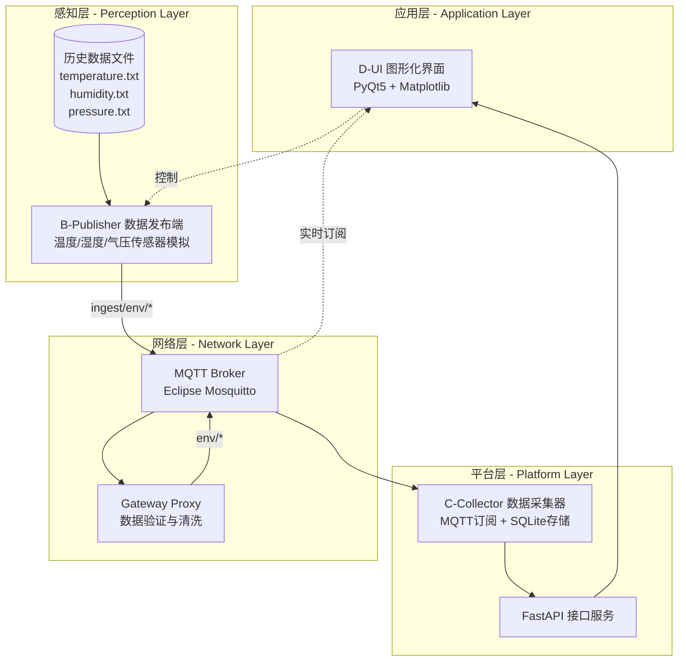

### 2.2 技术栈

系统采用多种成熟的开源技术构建，技术选型兼顾性能、稳定性和易用性：

#### 2.2.1 核心技术

| 技术组件 | 版本 | 用途 | 选型理由 |
|---------|------|------|---------|
| **MQTT** | 3.1.1 | 物联网消息协议 | 轻量级、低带宽、支持 QoS |
| **Eclipse Mosquitto** | 2.x | MQTT Broker | 开源、高性能、易配置 |
| **Python** | 3.8+ | 主要开发语言 | 生态丰富、开发效率高 |
| **SQLite** | 3.x | 嵌入式数据库 | 轻量级、无需独立服务器 |
| **PyQt5** | 5.15.10 | 桌面GUI框架 | 跨平台、功能强大 |

#### 2.2.2 Python 库依赖

**A 模块（MQTT Broker + Proxy）**
```python
paho-mqtt==1.6.1          # MQTT客户端库
```

**B 模块（Publisher）**
```python
paho-mqtt==1.6.1          # MQTT客户端库
# 仅使用Python标准库，无额外依赖
```

**C 模块（Collector）**
```python
paho-mqtt==1.6.1          # MQTT订阅
fastapi==0.115.0          # HTTP API框架
uvicorn[standard]==0.30.6 # ASGI服务器
sqlite3 (内置)            # 数据库
```

**D 模块（UI）**
```python
PyQt5==5.15.10            # GUI框架
matplotlib==3.8.2         # 数据可视化
paho-mqtt==1.6.1          # MQTT订阅
requests==2.31.0          # HTTP客户端
```

#### 2.2.3 开发工具

- **操作系统**：跨平台支持（Linux/macOS/Windows）
- **开发环境**：Python 3.8+
- **版本控制**：Git
- **API 测试**：Postman / cURL
- **MQTT 测试**：MQTT.fx / MQTTX

### 2.3 模块划分

系统采用分层架构，分为 4 个独立但协同工作的模块：

#### 模块 A：MQTT Broker + Gateway Proxy（网络层）

**职责**：
- 部署 Eclipse Mosquitto MQTT Broker，提供消息中转服务
- 监听 `0.0.0.0:1883` 端口，接受客户端连接
- 实现 ACL 权限控制，管理 4 个用户角色
- Gateway Proxy 订阅 `ingest/env/#`，进行数据验证和清洗
- 转发清洗后的数据到 `env/#` 主题

**关键技术**：
- Mosquitto 配置：监听、认证、ACL、持久化
- Python Gateway：数据验证、JSON 解析、去重算法

**输入/输出**：
- 输入：来自 B 模块的原始数据（`ingest/env/*`）
- 输出：清洗后的数据（`env/*`）

---

#### 模块 B：Data Publisher（感知层）

**职责**：读取历史文件，按速率发布到 MQTT；可选时间过滤，运行时支持暂停/恢复/调速/停止。

**关键技术**：文件解析与排序、精确速率控制、stdin 命令控制。

**输入/输出**：
- 输入：本地 txt 数据文件
- 输出：发布到 `ingest/env/{metric}` 主题

---

#### 模块 C：Data Collector（平台层）

**职责**：订阅 `env/#`，入库 SQLite（UNIQUE 去重），提供 FastAPI 查询/统计。

**关键技术**：MQTT 订阅、SQLite 索引与去重、FastAPI 接口。

**输入/输出**：
- 输入：订阅 `env/#` 主题的消息
- 输出：SQLite 数据库 + HTTP API 响应

---

#### 模块 D：GUI Application（应用层）

**职责**：
- 发布端控制：QProcess 调用 B 脚本
- 数据可视化：实时订阅 MQTT 绘图
- 数据查询：调用 C 模块 HTTP API
- 日统计：计算每日 max/min/avg

**关键技术**：
- PyQt5：多页面切换、QProcess 控制、信号槽机制
- Matplotlib：嵌入式图表、实时更新
- 多线程：HttpWorker/MqttWorker，避免 UI 阻塞

**输入/输出**：
- 输入：MQTT 消息（实时）+ HTTP API（历史）
- 输出：图形化界面展示

### 2.4 数据流向

系统的数据流动是一个典型的**生产者-消费者模式**，通过 MQTT Broker 实现解耦和异步通信：

#### 2.4.1 完整数据流程

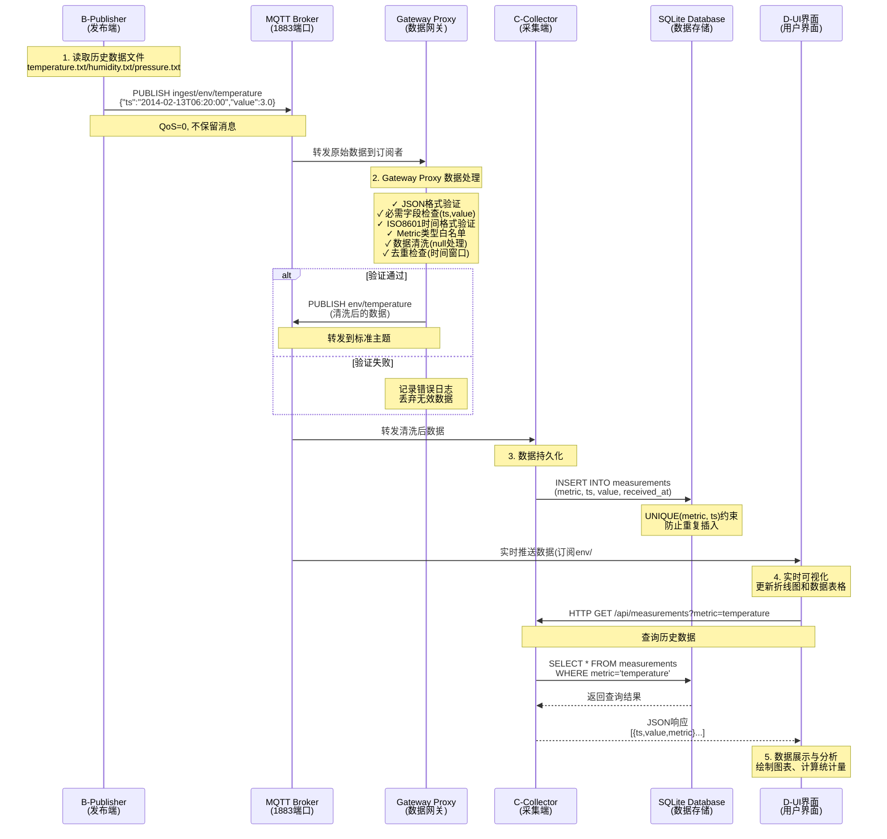

#### 2.4.2 Topic 主题设计

系统使用两层主题结构，实现数据隔离和权限控制（详见第 7 章）：

- ingest 层：`ingest/env/<metric>`，B 发布，Proxy 订阅
- env 层：`env/<metric>`，Proxy 发布，Collector/UI 订阅

#### 2.4.3 数据转换规则

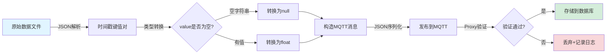

（转换规则与字段要求见第 7 章）

#### 2.4.4 数据流量估算

**发布速率**：可配置，默认 1-10 Hz

以 10Hz 为例，单个指标的数据流量：
- 每条消息大小：约 50 字节（JSON）
- 每秒消息量：10 条/秒
- 每秒流量：500 字节/秒 ≈ 0.5 KB/s
- 三个指标总流量：1.5 KB/s

**存储增长**：
- 每条记录：约 100 字节（SQLite overhead）
- 10Hz × 60秒 × 60分钟 = 36,000 条/小时
- 存储增长：≈ 3.6 MB/小时

---

## 3. A 模块：MQTT Broker + Gateway Proxy

### 3.1 模块概述

A 模块是整个物联网系统的**网络层核心**，由两个关键组件构成：

#### 3.1.1 核心组件

**1. MQTT Broker（Eclipse Mosquitto）**

作为消息中转服务器，负责：
- 监听 TCP 端口 `0.0.0.0:1883`，接受所有网络接口的连接
- 管理客户端连接，维护订阅关系
- 按照发布/订阅模式转发消息
- 提供基于 ACL 的权限控制
- 支持消息持久化和日志记录

**2. Gateway Proxy（Python 服务）**

作为智能数据网关，负责：
- 订阅原始数据主题 `ingest/env/#`
- 验证消息格式（JSON、必需字段、时间格式）
- 清洗数据（类型转换、null 处理）
- 去重检测（基于时间窗口的 LRU 缓存）
- 转发清洗后的数据到 `env/#` 主题
- 记录详细的处理日志和统计信息

#### 3.1.2 设计思想

**为什么需要 Gateway Proxy？**

1. **数据质量保证**：物联网设备可能发送格式错误或异常的数据，Gateway 可以过滤这些"脏数据"
2. **系统解耦**：发布端（B）和订阅端（C）通过两层 Topic 隔离，降低耦合度
3. **统一处理**：数据清洗逻辑集中在 Gateway，避免每个订阅端都要实现一遍
4. **安全防护**：通过 ACL 限制 publisher 只能发布到 ingest 层，防止恶意数据直接进入系统

**两层 Topic 设计**：

```
[B-Publisher] ---> ingest/env/* ---> [Gateway Proxy] ---> env/* ---> [C-Collector]
                     (原始数据)                          (清洗后)
```

### 3.2 MQTT Broker 配置

#### 3.2.1 Mosquitto 安装

使用系统包管理器安装 `mosquitto` 与 `mosquitto-clients`（apt/yum/brew 均可），安装后用 `mosquitto_pub`/`mosquitto_sub` 验证。

#### 3.2.2 配置文件说明

核心配置文件 `mosquitto-system.conf`，位于 `A-deploy/iot-project/deploy/broker/`：

```properties
listener 1883 0.0.0.0
allow_anonymous false
password_file /etc/mosquitto/password_file
acl_file /etc/mosquitto/acl
...
persistence true
persistence_location /var/lib/mosquitto/
...
log_dest file /var/log/mosquitto/mosquitto.log
log_dest stdout
...
max_packet_size 10485760
max_queued_messages 1000
max_keepalive 60
```

**关键参数解释**：

| 参数 | 值 | 说明 |
|------|-----|------|
| `listener` | 1883 0.0.0.0 | 监听所有网络接口，支持远程连接 |
| `allow_anonymous` | false | 强制认证，提高安全性 |
| `password_file` | /etc/mosquitto/password_file | 加密密码存储位置 |
| `acl_file` | /etc/mosquitto/acl | 权限控制规则文件 |
| `persistence` | true | 启用持久化，防止数据丢失 |
| `log_timestamp_format` | ISO8601 | 统一时间格式 |

#### 3.2.3 用户认证配置

**创建用户账号**：用 `mosquitto_passwd` 生成 admin/publisher/proxy/collector（密码见表），或运行提供的 `generate_passwords.sh`。

**用户角色说明**：

| 用户名 | 密码 | 角色 | 用途 |
|--------|------|------|------|
| `admin` | admin123 | 管理员 | 全部权限，用于测试和管理 |
| `publisher` | pub123 | 发布端 | B 模块使用，仅能发布到 ingest/env/# |
| `proxy` | proxy123 | 网关 | Gateway Proxy 使用，读 ingest、写 env |
| `collector` | col123 | 采集端 | C/D 模块使用，仅能订阅 env/# |

**密码文件格式**：

```
admin:$7$101$...(加密后的密码哈希)
publisher:$7$101$...
proxy:$7$101$...
collector:$7$101$...
```

**自动生成脚本**（`generate_passwords.sh`）：

```bash
#!/bin/bash
# 自动生成所有用户

PWD_FILE="password_file"

# 删除旧文件
rm -f $PWD_FILE

# 创建用户
echo "Creating users..."
mosquitto_passwd -b -c $PWD_FILE admin admin123
mosquitto_passwd -b $PWD_FILE publisher pub123
mosquitto_passwd -b $PWD_FILE proxy proxy123
mosquitto_passwd -b $PWD_FILE collector col123

echo "✓ Password file created: $PWD_FILE"
echo "✓ Users: admin, publisher, proxy, collector"
```

### 3.3 Gateway Proxy 实现

#### 3.3.1 功能设计

Gateway Proxy 是用 Python 实现的智能数据网关，作为 MQTT 客户端连接到 Broker，具有以下功能模块：

**核心功能模块**：

1. **配置管理**（Config 类）
   - 从环境变量读取配置（Broker地址、用户名密码等）
   - 定义主题映射规则（ingest → env）
   - 配置去重缓存参数

2. **数据验证器**（PayloadValidator 类）
   - JSON 格式验证
   - 必需字段检查（ts, value）
   - ISO8601 时间格式验证
   - 数据类型转换和清洗

3. **去重缓存**（DedupCache 类）
   - LRU (Least Recently Used) 算法
   - 基于 (metric, ts) 的唯一性检查
   - 自动清理过期条目（TTL机制）

4. **MQTT 网关**（MQTTGateway 类）
   - 连接管理和自动重连
   - 消息接收和处理
   - 数据转发
   - 统计信息记录

**数据处理流程图**：

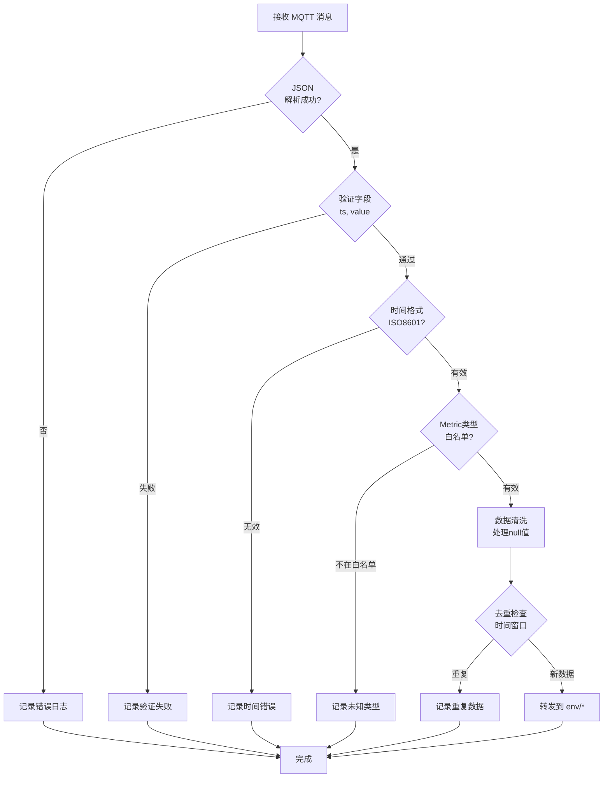

#### 3.3.2 核心代码实现

**代码示例 1：数据验证器**

```python
class PayloadValidator:
    @staticmethod
    def validate_and_clean(payload_str: str) -> Tuple[Optional[Dict[str, Any]], Optional[str]]:
        try:
            data = json.loads(payload_str)
        except json.JSONDecodeError as e:
            return None, f"Invalid JSON: {str(e)}"

        if not isinstance(data, dict):
            return None, "Payload must be a JSON object"
        if "ts" not in data or "value" not in data:
            return None, "Missing required field"

        ts = data["ts"]
        value = data["value"]
        if not isinstance(ts, str) or not PayloadValidator._is_valid_iso8601(ts):
            return None, f"Field 'ts' is not valid ISO8601 format: {ts}"

        cleaned_value, _ = PayloadValidator._clean_value(value)
        return {"ts": ts, "value": cleaned_value}, None

    @staticmethod
    def _clean_value(value: Any) -> Tuple[Any, bool]:
        if value is None:
            return None, False
        if isinstance(value, (int, float)):
            return value, False
        if isinstance(value, str):
            if value == "":
                return None, True
            try:
                return (int(value) if '.' not in value else float(value)), True
            except ValueError:
                return None, True
        return None, True
```

**代码说明**：

- **严格验证**：确保 JSON 格式正确、必需字段存在、时间格式符合 ISO8601
- **智能清洗**：自动处理空字符串、字符串数字、null 值等边缘情况
- **容错机制**：对于无法处理的值，转为 null 而非直接丢弃整条数据

**代码示例 2：消息处理回调**

```python
def on_message(self, client, userdata, msg):
    self.stats["received"] += 1
    topic = msg.topic
    payload = msg.payload.decode('utf-8', errors='ignore')

    if not topic.startswith(Config.INGEST_PREFIX):
        return
    metric = topic[len(Config.INGEST_PREFIX):]
    if metric not in Config.ALLOWED_METRICS:
        self.stats["dropped"] += 1
        return

    cleaned_payload, error_reason = PayloadValidator.validate_and_clean(payload)
    if cleaned_payload is None:
        self.stats["dropped"] += 1
        return

    if self.dedup_cache and self.dedup_cache.is_duplicate(metric, cleaned_payload["ts"]):
        self.stats["duplicated"] += 1
        return

    output_topic = f"{Config.OUTPUT_PREFIX}{metric}"
    client.publish(output_topic, json.dumps(cleaned_payload, separators=(',', ':')))
    self.stats["forwarded"] += 1
```

**代码说明**：

- **多层验证**：主题前缀 → metric 白名单 → payload 验证 → 去重检查
- **详细日志**：记录每一步的处理结果，便于调试和审计
- **统计信息**：实时统计接收、转发、丢弃、去重等数量
- **容错处理**：任何环节失败都不会中断整个服务

**运行日志示例**：

```
2025-12-26T10:30:15 - MQTTProxy - INFO - ✓ Connected to MQTT Broker successfully
2025-12-26T10:30:15 - MQTTProxy - INFO - ✓ Subscribed to: ingest/env/#
2025-12-26T10:30:15 - MQTTProxy - INFO - Gateway is ready to forward messages
2025-12-26T10:30:16 - MQTTProxy - INFO - FORWARD | ingest/env/temperature → env/temperature | ts=2014-02-13T06:20:00 | value=3.0
2025-12-26T10:30:16 - MQTTProxy - INFO - FORWARD | ingest/env/humidity → env/humidity | ts=2014-02-13T06:20:00 | value=72.0
2025-12-26T10:30:17 - MQTTProxy - WARNING - DROP | topic=ingest/env/temperature | reason=Field 'ts' is not valid ISO8601 format | raw_payload={"ts":"2014-02-13","value":5}
2025-12-26T10:30:18 - MQTTProxy - INFO - DUPLICATE | topic=ingest/env/temperature | ts=2014-02-13T06:20:00 | dropped
```

**部署测试截图**：

> 
>
> **【图片 A-2】**: MQTT Broker 启动成功截图
>
> **说明**: 显示 Mosquitto 服务成功启动，监听在 1883 端口，加载 ACL 文件成功的日志输出

> 
>
> **【图片 A-3】**: Gateway Proxy 运行状态截图
>
> **说明**: 展示 Gateway Proxy 连接到 Broker，订阅 ingest/env/# 主题成功，并显示实时处理数据的日志

---

Gateway Proxy 作为数据网关，负责：

1. **数据验证**：检查 JSON 格式、必需字段、时间格式
2. **数据清洗**：处理缺失值、异常值
3. **数据去重**：基于时间窗口的去重机制
4. **数据转发**：转发到标准主题


### 3.4 ACL 权限控制

#### 3.4.1 用户角色设计

ACL（Access Control List）访问控制列表是 MQTT Broker 的核心安全机制，通过精细化的权限控制，确保每个客户端只能访问其职责范围内的主题。

**权限类型**：
- `read`：只能订阅（SUBSCRIBE）该主题
- `write`：只能发布（PUBLISH）到该主题
- `readwrite`：可以订阅和发布

**四个用户角色及权限矩阵**：

| 用户 | ingest/env/# | env/# | 全部主题 (#) | 用途说明 |
|------|-------------|-------|------------|----------|
| `admin` | ✓ 读写 | ✓ 读写 | ✓ 读写 | 管理员，用于测试和监控 |
| `publisher` | ✓ 写 | ✗ | ✗ | B模块，只能发布原始数据 |
| `proxy` | ✓ 读 | ✓ 写 | ✗ | Gateway，读原始写清洗后 |
| `collector` | ✗ | ✓ 读 | ✗ | C/D模块，只能订阅清洗后数据 |

#### 3.4.2 ACL 配置文件

ACL 文件位于 `A-deploy/iot-project/deploy/broker/acl`：

```properties
# ACL (Access Control List) for IoT Project
# Format: user <username>
#         topic [read|write|readwrite] <topic>
#
# Wildcard:
#   # matches multiple levels (e.g., env/# matches env/temperature)
#   + matches single level (e.g., env/+ matches env/temperature only)

# ============================================================
# Admin Account (Optional - Full Access)
# ============================================================
user admin
topic readwrite #

# ============================================================
# Publisher Account (发布端 B 使用)
# ============================================================
# 只允许向 ingest/env/# 发布数据
user publisher
topic write ingest/env/#

# ============================================================
# Proxy Account (代理服务使用)
# ============================================================
# 允许读取 ingest/env/# （接收上游数据）
# 允许写入 env/# （转发到下游）
user proxy
topic read ingest/env/#
topic write env/#

# ============================================================
# Collector Account (订阅端 C 使用)
# ============================================================
# 只允许订阅 env/# （接收官方数据）
user collector
topic read env/#

# ============================================================
# 系统 Topic（所有用户只读）
# ============================================================
pattern read $SYS/#
```

**设计亮点**：

1. **最小权限原则**：每个用户只有完成其任务所需的最小权限
2. **单向数据流**：publisher → proxy → collector，防止数据回流
3. **安全隔离**：原始数据和清洗后数据分离，避免污染
4. **灵活扩展**：可以轻松添加新的用户角色

**权限验证测试**：

```bash
# 测试 publisher 用户
# 应该成功：
mosquitto_pub -h localhost -u publisher -P pub123 -t ingest/env/temperature -m '{"ts":"2024-01-01T00:00:00","value":10}'

# 应该失败（没有写 env/# 的权限）：
mosquitto_pub -h localhost -u publisher -P pub123 -t env/temperature -m '{"test":"data"}'

# 测试 collector 用户  
# 应该成功：
mosquitto_sub -h localhost -u collector -P col123 -t env/#

# 应该失败（没有订阅 ingest/# 的权限）：
mosquitto_sub -h localhost -u collector -P col123 -t ingest/env/#
```

### 3.5 部署说明

#### 3.5.1 系统级部署（推荐）

**步骤 1：复制配置文件**

```bash
cd A-deploy/iot-project/deploy/broker

# 复制配置文件到系统目录
sudo cp mosquitto-system.conf /etc/mosquitto/mosquitto.conf
sudo cp acl /etc/mosquitto/acl

# 生成密码文件
bash generate_passwords.sh
sudo cp password_file /etc/mosquitto/password_file

# 设置权限
sudo chmod 600 /etc/mosquitto/password_file
sudo chown mosquitto:mosquitto /etc/mosquitto/password_file
```

**步骤 2：创建必要的目录**

```bash
# 创建日志目录
sudo mkdir -p /var/log/mosquitto
sudo chown mosquitto:mosquitto /var/log/mosquitto

# 创建持久化目录
sudo mkdir -p /var/lib/mosquitto
sudo chown mosquitto:mosquitto /var/lib/mosquitto
```

**步骤 3：启动 Mosquitto 服务**

```bash
# 使用 systemd（推荐）
sudo systemctl start mosquitto
sudo systemctl enable mosquitto  # 开机自启
sudo systemctl status mosquitto  # 查看状态

# 或者直接运行（用于调试）
mosquitto -c /etc/mosquitto/mosquitto.conf -v
```

**步骤 4：启动 Gateway Proxy**

```bash
cd A-deploy/iot-project/deploy/proxy

# 安装依赖
pip install -r requirements.txt

# 配置环境变量（可选）
export MQTT_BROKER_HOST="localhost"
export MQTT_BROKER_PORT="1883"
export MQTT_USERNAME="proxy"
export MQTT_PASSWORD="proxy123"
export LOG_LEVEL="INFO"

# 启动服务
python app/main.py
```

#### 3.5.2 验证部署

**检查 Mosquitto 状态**：

```bash
# 查看进程
ps aux | grep mosquitto

# 查看监听端口
sudo netstat -tlnp | grep 1883
# 或
sudo ss -tlnp | grep 1883

# 查看日志
sudo tail -f /var/log/mosquitto/mosquitto.log
```

**测试连接**：

```bash
# 测试订阅（新终端1）
mosquitto_sub -h localhost -p 1883 -u admin -P admin123 -t "#" -v

# 测试发布（新终端2）
mosquitto_pub -h localhost -p 1883 -u admin -P admin123 -t test/topic -m "Hello MQTT"
```

#### 3.5.3 常见问题

**问题 1：端口已被占用**

```bash
# 查找占用1883端口的进程
sudo lsof -i :1883

# 杀死进程或修改配置文件端口
```

**问题 2：权限被拒绝**

```bash
# 检查配置文件权限
ls -l /etc/mosquitto/

# 修正权限
sudo chown -R mosquitto:mosquitto /etc/mosquitto
sudo chmod 644 /etc/mosquitto/mosquitto.conf
```

**问题 3：无法连接**

```bash
# 检查防火墙
sudo ufw status
sudo ufw allow 1883/tcp

# 检查 Mosquitto 是否监听
sudo netstat -tlnp | grep 1883
```

---

## 4. B 模块：数据发布端 (Publisher)

### 4.1 模块概述

B 模块模拟物联网传感器设备，负责从历史数据文件中读取环境监测数据，并按指定速率通过 MQTT 协议发布到 Broker。

**主要功能**：

1. **数据源管理**
   - 支持三种指标：temperature（温度）、humidity（湿度）、pressure（气压）
   - 从 JSON 文件读取历史数据
   - 支持时间范围过滤（start/end 参数）

2. **发布速率控制**
   - 精确的时间间隔控制（Hz）
   - 支持动态调速（运行时修改 rate）
   - 使用 `perf_counter()` 实现高精度定时

3. **运行控制**
   - 暂停/恢复：暂时停止发布，保留进度
   - 停止：完全结束发布任务
   - 调速：动态修改发布速率
   - 通过 stdin 命令控制（在终端输入）

4. **进度监控**
   - 实时显示发布进度（每100条打印一次）
   - 显示当前时间戳和数值
   - 统计发布总数和完成百分比

**技术亮点**：

- **多线程设计**：主线程负责发布，控制线程监听 stdin 命令
- **事件驱动**：使用 `threading.Event` 实现线程间通信
- **无阻塞设计**：MQTT 异步发布，QoS=0，不等待确认
- **容错处理**：连接失败自动退出，避免卡死

### 4.2 数据文件格式

历史数据文件存储在 `B-publisher/data/` 目录：

- `temperature.txt`：温度数据（单位：℃）
- `humidity.txt`：湿度数据（单位：%）  
- `pressure.txt`：气压数据（单位：hPa）

**文件结构**：

每行是一个 JSON 对象，包含多个时间戳-数值对：

```json
{"2014-02-13T06:20:00": "3.0", "2014-02-13T13:50:00": "7.0", "2014-02-13T06:00:00": "2", ...}
```

**数据格式详解**：

- **Key（时间戳）**：ISO8601 格式字符串，例如 `"2014-02-13T06:20:00"`
- **Value（数值）**：字符串类型，需要转换为浮点数
  - 整数格式：`"2"`
  - 浮点数格式：`"3.0"`
  - 缺失值：`""` （空字符串）

**数据特点**：

1. **时间顺序**：文件内时间戳不按顺序排列，需要读取后排序
2. **采样间隔**：不规则，大约10-30分钟一次
3. **数据量**：每个文件约117行，每行70个键值对，总计约2000+条记录
4. **缺失值**：有少量空字符串值，表示传感器故障

**数据文件截图**：

> 
>
> **【图片 B-1】**: 原始数据文件内容截图
>
> **说明**: 展示 humidity.txt 的前 20 行数据，包含时间戳和对应的数值，以及可能的空值情况

### 4.3 核心实现逻辑

#### 4.3.1 数据读取与解析

**代码实现**：

```python
def read_file(path, start, end):
    results = []
    with open(path, 'r') as file:
        for line in file:
            data = json.loads(line)
            for key, value in data.items():
                if start and key < start or end and key > end:
                    continue
                results.append({"ts": key, "value": None if value == "" else float(value)})
    results.sort(key=lambda r: r["ts"])
    return results
```

**关键技术点**：

1. **JSON 解析**：每行是一个独立的 JSON 对象，使用 `json.loads()` 解析
2. **时间过滤**：使用字符串比较（ISO8601 格式天然支持字典序比较）
3. **类型转换**：空字符串转 null，字符串数字转浮点数
4. **排序**：确保数据按时间顺序发布，符合真实场景

#### 4.3.2 MQTT 发布机制

**代码实现**：

```python
def publish_data(metric, rate=1, start=None, end=None):
    global rate_hz
    rate_hz = float(rate)
    script_dir = os.path.dirname(os.path.abspath(__file__))
    input_dict = {
        'temperature': os.path.join(script_dir, 'data', 'temperature.txt'),
        'humidity': os.path.join(script_dir, 'data', 'humidity.txt'),
        'pressure': os.path.join(script_dir, 'data', 'pressure.txt')
    }
    payloads = read_file(input_dict[metric], start, end)
    client = mqtt.Client()
    client.username_pw_set(USERNAME, PASSWORD)
    client.on_connect = on_connect
    client.on_publish = on_publish
    client.connect(BROKER_HOST, BROKER_PORT, 60)
    client.loop_start()
    topic = f"ingest/env/{metric}"
    print(f"准备发布 {len(payloads)} 条数据，速率: {rate_hz} Hz")
    # 发布主循环（见下节）
    # ...
```

**连接回调**：

```python
def on_connect(client, userdata, flags, rc):
    """连接成功回调"""
    if rc == 0:
        print("✓ 已连接到 Broker")
    else:
        print(f"✗ 连接失败 (错误码: {rc})")
        sys.exit(1)

def on_publish(client, userdata, mid):
    """发布成功回调"""
    pending_mids.discard(mid)  # 从待确认集合中移除
```

#### 4.3.3 速率控制实现

发布速率控制是本模块的核心技术，确保数据按精确的时间间隔发送：

**代码实现**：

```python
i = 0
next_send = time.perf_counter()
total = len(payloads)

while i < total and not stop_event.is_set():
    pause_event.wait()
    if resume_event.is_set():
        next_send = time.perf_counter()
        resume_event.clear()

    now = time.perf_counter()
    if next_send > now:
        time.sleep(next_send - now)

    payload = payloads[i]
    if (i + 1) % 100 == 0 or i == total - 1:
        print(f"[进度] {i+1}/{total} - {payload['ts']}")

    pending_mids.add(client.publish(topic, json.dumps(payload), qos=0).mid)
    interval = 1.0 / max(rate_hz, 0.0001)
    next_send += interval
    i += 1

...  # 等待确认、断开连接
```

**技术亮点**：

1. **高精度定时**：使用 `perf_counter()` 而非 `time.time()`，精度更高
2. **累积误差消除**：每次发送后累加 interval，而非重新计算，避免累积误差
3. **动态调速**：`rate_hz` 是全局变量，可在运行时修改
4. **非阻塞发布**：QoS=0 不等待确认，提高吞吐量
5. **优雅退出**：等待所有消息发送完毕再断开连接

**发布流程图**：

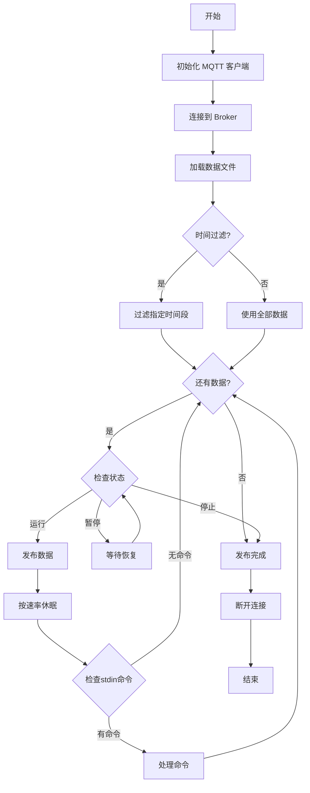

### 4.4 运行控制机制

#### 4.4.1 控制命令

发布程序支持通过 **stdin** 输入命令来控制运行状态：

| 命令 | 功能 | 说明 |
|------|------|------|
| `pause` | 暂停发布 | 停止发送数据，保留当前进度 |
| `resume` | 恢复发布 | 从暂停处继续发送数据 |
| `stop` | 停止发布 | 完全结束程序，退出 |
| `rate <Hz>` | 动态调速 | 修改发布速率，例如：`rate 5` |

#### 4.4.2 多线程控制

**控制线程实现**：

```python
def control_loop():
    global rate_hz
    while not stop_event.is_set():
        cmd = sys.stdin.readline().strip().lower()
        if cmd == "pause":
            pause_event.clear()
        elif cmd == "resume":
            pause_event.set(); resume_event.set()
        elif cmd.startswith("rate "):
            try:
                rate_hz = float(cmd.split()[1])
            except:
                pass
        elif cmd == "stop":
            stop_event.set(); pause_event.set()

t = threading.Thread(target=control_loop, daemon=True)
t.start()
```

**事件对象说明**：

```python
pause_event = threading.Event()   # True=运行；False=暂停
stop_event = threading.Event()    # True=停止
resume_event = threading.Event()  # True=刚恢复运行

pause_event.set()  # 默认为运行状态
```

**控制流程图**：

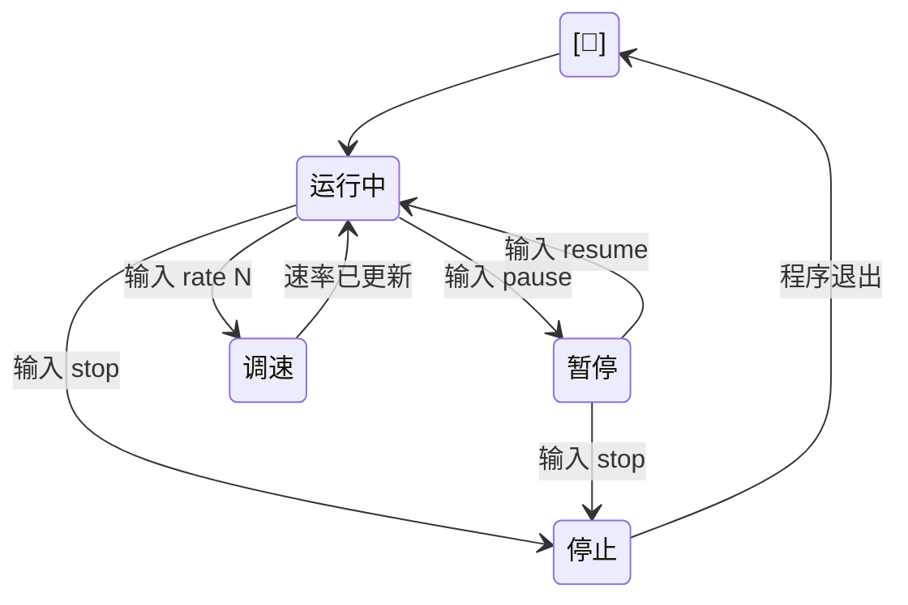

### 4.5 使用说明

命令行常用示例：

```bash
cd B-publisher
# 全量 1Hz 温度
python publish.py -m temperature -r 1
# 10Hz 气压，指定日期范围
python publish.py -m pressure -r 10 -s "2014-02-13T00:00:00" -e "2014-02-13T23:59:59"
```

运行时控制：在终端输入 `pause` / `resume` / `rate <Hz>` / `stop`。

通过 D-UI：启动 `python D-ui/main.py`，在发布端页面选择指标与速率，Start/Stop 控制，日志即时展示。

---

## 5. C 模块：数据采集端 (Collector)

### 5.1 模块概述

C 模块是系统的**数据平台层**，负责订阅清洗后的环境监测数据并持久化存储，同时提供 HTTP API 接口供上层应用查询。

**核心职责**：

1. **MQTT 数据订阅**
   - 订阅 `env/#` 主题，接收清洗后的数据
   - 使用 `collector` 用户连接，权限受 ACL 控制
   - 实时解析 JSON 消息，提取 metric、ts、value

2. **数据持久化存储**
   - 使用 SQLite 嵌入式数据库
   - 自动建表、索引优化
   - UNIQUE 约束防止重复数据
   - 记录接收时间戳（received_at）

3. **HTTP API 服务**
   - 基于 FastAPI 框架
   - 提供 RESTful 接口
   - 支持数据查询、统计分析
   - 自动生成 Swagger 文档

**技术特点**：

- **异步处理**：MQTT 订阅和 FastAPI 服务可独立运行
- **数据完整性**：UNIQUE 约束 + INSERT OR REPLACE 策略
- **查询优化**：合理的索引设计提高查询效率
- **容错机制**：JSON 解析失败不影响后续消息处理

### 5.2 数据库设计

#### 5.2.1 表结构设计

采用 SQLite 数据库存储数据，表结构如下：

```sql
CREATE TABLE IF NOT EXISTS measurements (
    id INTEGER PRIMARY KEY AUTOINCREMENT,
    metric TEXT NOT NULL,
    ts TEXT NOT NULL,
    value REAL,
    received_at TEXT NOT NULL,
    UNIQUE(metric, ts)
);
```

**ER 图**：

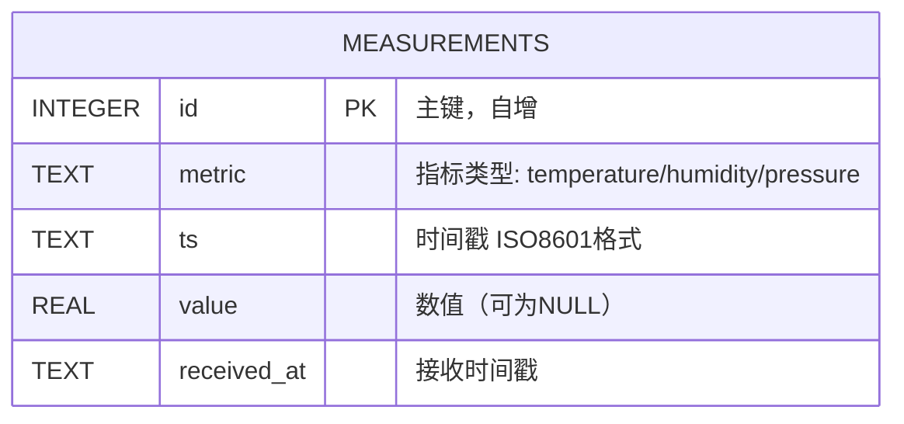

**字段说明**：

| 字段名 | 类型 | 约束 | 说明 |
|--------|------|------|------|
| `id` | INTEGER | PRIMARY KEY AUTOINCREMENT | 主键，自动递增 |
| `metric` | TEXT | NOT NULL | 指标类型（temperature/humidity/pressure） |
| `ts` | TEXT | NOT NULL | 原始时间戳，ISO8601 字符串格式 |
| `value` | REAL | - | 测量值，允许 NULL（缺失值） |
| `received_at` | TEXT | NOT NULL | 接收时间戳，用于审计和排查 |
| `UNIQUE(metric, ts)` | - | 联合唯一约束 | 防止同一时刻的重复数据 |

**设计考虑**：

1. **时间戳存储为 TEXT**：
   - ISO8601 格式天然支持字典序排序
   - 避免时区转换问题
   - SQLite 字符串比较效率高

2. **value 允许 NULL**：
   - 符合传感器故障的真实场景
   - 统计分析时可单独处理缺失值

3. **UNIQUE 约束**：
   - `(metric, ts)` 联合唯一
   - 自动防止重复数据
   - INSERT OR REPLACE 策略更新重复数据

#### 5.2.2 索引优化

为提高查询效率，创建两个复合索引：

```sql
-- 索引1：按 metric 和时间戳查询（最常用）
CREATE INDEX IF NOT EXISTS idx_metric_ts 
ON measurements(metric, ts);

-- 索引2：按接收时间查询（用于监控和审计）
CREATE INDEX IF NOT EXISTS idx_received_at 
ON measurements(received_at);
```

**索引效果分析**：

| 查询场景 | 无索引 | 有索引 | 性能提升 |
|---------|--------|--------|---------|
| 查询某指标的全部数据 | 全表扫描 | 索引扫描 | ~10x |
| 查询某指标的时间范围 | 全表扫描 | 索引范围扫描 | ~50x |
| 按接收时间查询 | 全表扫描 | 索引扫描 | ~10x |

### 5.3 MQTT 订阅实现

#### 5.3.1 连接与订阅

**初始化代码**：

```python
BROKER_HOST = "139.224.237.20"
BROKER_PORT = 1883
USERNAME = "collector"
PASSWORD = "col123"
SUBSCRIBE_TOPIC = "env/#"

client = mqtt.Client()
client.username_pw_set(USERNAME, PASSWORD)
client.on_connect = on_connect
client.on_message = on_message
client.on_subscribe = on_subscribe
client.on_disconnect = on_disconnect
client.connect(BROKER_HOST, BROKER_PORT, 60)
client.loop_forever()
```

**连接回调**：

```python
def on_connect(client, userdata, flags, rc):
    if rc == 0:
        print(f"✓ 已连接到 Broker: {BROKER_HOST}:{BROKER_PORT}")
        print(f"✓ 正在订阅主题: {SUBSCRIBE_TOPIC}")
        client.subscribe(SUBSCRIBE_TOPIC, qos=0)
    else:
        print(f"✗ 连接失败 (错误码: {rc})")
        sys.exit(1)

def on_subscribe(client, userdata, mid, granted_qos):
    """订阅成功回调"""
    print(f"✓ 订阅成功! 等待消息...")
    print("-" * 60)
```

#### 5.3.2 消息处理回调

**核心实现**：

```python
def on_message(client, userdata, msg):
    try:
        topic = msg.topic
        metric = topic.split('/')[-1]
        payload = json.loads(msg.payload.decode('utf-8'))
        ts = payload.get('ts')
        value = payload.get('value')
        if not ts:
            return
        if save_measurement(metric, ts, value) and VERBOSE:
            print(f"📊 [{metric}] ts={ts}, value={value}")
    except Exception:
        print(f"✗ 处理消息失败: {msg.payload.decode('utf-8', errors='ignore')}")

def save_measurement(metric, ts, value):
    try:
        conn = sqlite3.connect(DB_PATH)
        cursor = conn.cursor()
        received_at = datetime.now().isoformat()
        cursor.execute('''
            INSERT OR REPLACE INTO measurements (metric, ts, value, received_at)
            VALUES (?, ?, ?, ?)
        ''', (metric, ts, value, received_at))
        conn.commit()
        conn.close()
        return True
    except Exception as e:
        print(f"✗ 数据库写入失败: {e}")
        return False
```

**订阅流程图**：

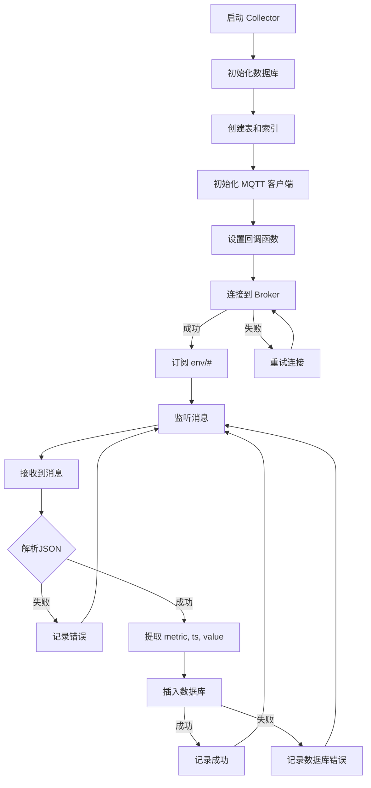

### 5.4 HTTP API 接口

#### 5.4.1 FastAPI 应用设计

基于 FastAPI 框架实现 RESTful API，提供数据查询和统计服务：

**应用初始化**：

```python
from fastapi import FastAPI, HTTPException, Query
from fastapi.middleware.cors import CORSMiddleware

app = FastAPI(title="IoT Collector API", version="1.0.0")

# 允许跨域访问（用于前端调用）
app.add_middleware(
    CORSMiddleware,
    allow_origins=["*"],
    allow_credentials=True,
    allow_methods=["*"],
    allow_headers=["*"],
)

@app.on_event("startup")
def on_startup():
    """应用启动时确保数据库已初始化"""
    init_database()
```

#### 5.4.2 API 端点说明

**API 接口列表**：

| 端点 | 方法 | 参数 | 说明 |
|------|------|------|------|
| `/api/realtime` | GET | metric, limit | 获取最近 N 条数据 |
| `/api/history` | GET | metric, from, to | 查询历史数据（时间范围） |
| `/api/stats` | GET | metric, from, to | 统计分析（min/max/mean） |

#### 5.4.3 接口实现代码

**1. 实时数据接口**：

```python
@app.get("/api/realtime")
def get_realtime(
    metric: Literal["temperature", "humidity", "pressure"] = Query(...),
    limit: int = Query(200, ge=1, le=2000)
):
    conn = get_db_connection()
    try:
        cur = conn.cursor()
        cur.execute("""
            SELECT ts, value
            FROM measurements
            WHERE metric = ?
            ORDER BY ts DESC
            LIMIT ?
        """, (metric, limit))
        rows = cur.fetchall()
    finally:
        conn.close()

    points = [
        {"ts": row["ts"], "value": row["value"]} 
        for row in reversed(rows)
    ]

    return {"metric": metric, "points": points}
```

**2. 历史数据接口**：

```python
@app.get("/api/history")
def get_history(
    metric: Literal["temperature", "humidity", "pressure"] = Query(...),
    from_ts: Optional[str] = Query(None, alias="from"),
    to_ts: Optional[str] = Query(None, alias="to")
):
    if from_ts is None and to_ts is None:
        raise HTTPException(
            status_code=400, 
            detail="至少需要提供 from 或 to 参数"
        )

    conn = get_db_connection()
    try:
        cur = conn.cursor()

        conditions = ["metric = ?"]
        params = [metric]

        if from_ts is not None:
            conditions.append("ts >= ?")
            params.append(from_ts)
        if to_ts is not None:
            conditions.append("ts <= ?")
            params.append(to_ts)

        where_sql = " AND ".join(conditions)

        sql = f"SELECT ts, value FROM measurements WHERE {where_sql} ORDER BY ts ASC"
        cur.execute(sql, params)
        rows = cur.fetchall()
    finally:
        conn.close()

    points = [{"ts": row["ts"], "value": row["value"]} for row in rows]
    return {"metric": metric, "points": points}
```

**3. 统计分析接口**：

```python
@app.get("/api/stats")
def get_stats(
    metric: Literal["temperature", "humidity", "pressure"] = Query(...),
    from_ts: Optional[str] = Query(None, alias="from"),
    to_ts: Optional[str] = Query(None, alias="to")
):
    conn = get_db_connection()
    try:
        cur = conn.cursor()

        conditions = ["metric = ?"]
        params = [metric]

        if from_ts is not None:
            conditions.append("ts >= ?")
            params.append(from_ts)
        if to_ts is not None:
            conditions.append("ts <= ?")
            params.append(to_ts)

        where_sql = " AND ".join(conditions)

        sql = f"""
            SELECT COUNT(*) AS total_count, COUNT(value) AS non_null_count,
                   MIN(value) AS min_val, MAX(value) AS max_val, AVG(value) AS avg_val
            FROM measurements WHERE {where_sql}
        """
        cur.execute(sql, params)
        row = cur.fetchone()
    finally:
        conn.close()

    if row is None:
        raise HTTPException(status_code=500, detail="统计查询失败")

    total = row["total_count"] or 0
    non_null = row["non_null_count"] or 0
    missing = int(total - non_null)

    return {
        "metric": metric,
        "count": int(total),
        "missing": missing,
        "min": row["min_val"],
        "max": row["max_val"],
        "mean": row["avg_val"],
    }
```

### 5.5 数据验证机制

虽然 Gateway Proxy 已经进行了数据验证，但 Collector 仍然需要基本的容错处理：

**验证策略**：

1. **JSON 解析容错**：解析失败记录日志但不中断服务
2. **必需字段检查**：确保 `ts` 字段存在
3. **NULL 值处理**：允许 `value` 为 null
4. **数据库约束**：UNIQUE 约束自动去重
5. **异常捕获**：所有数据库操作都有异常处理

**Collector 运行截图**：

> 
>
> **【图片 C-3】**: Collector 接收数据截图
>
> **说明**: 显示 Collector 成功订阅主题，实时接收并存储数据到数据库的日志输出，包含数据统计信息

---

## 6. D 模块：图形化界面 (UI)

### 6.1 模块概述
基于 PyQt5，提供一体化控制台：左侧启动/暂停/停止 B-Publisher，右侧实时订阅 C-Collector 数据并绘图。采用 QSplitter 将发布端与订阅端并列，启动入口位于 [D-ui/main.py](D-ui/main.py)。

### 6.2 界面设计

#### 6.2.1 整体布局

采用 PyQt5 的 QStackedWidget 实现多页面切换：

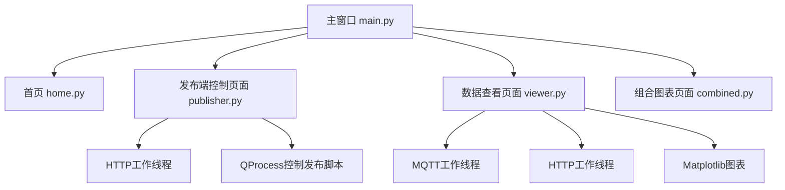

#### 6.2.2 主要页面
- **发布端 (左侧)**：下拉选择指标，设置速率与日期范围，Start/Pause/Stop 控制发布进程，状态标签实时更新。
- **订阅端 (右侧)**：Tab 切换温度/湿度/气压，订阅 env/* 主题，展示实时折线图与表格，并按天汇总 min/max/avg。
- **组合页面**：在同一视图内完成发布控制与数据查看，便于演示闭环链路。

### 6.3 发布端控制页面

#### 6.3.1 功能设计
- 通过 QProcess 启动 `B-publisher/publish.py`，支持速率和时间范围参数。
- 向子进程标准输入写入 `pause` / `resume` / `rate N` / `stop`，对应 B 模块的控制协议。
- 进程输出实时回显，状态变化通过信号更新 UI。

#### 6.3.2 QProcess 进程管理
```python
class PublisherController(QObject):
    def start(self, rate: float, start_ts: str = None, end_ts: str = None):
        script_path = config.get_publisher_script_path()
        self.process = QProcess(self)
        self.process.setProcessChannelMode(QProcess.MergedChannels)
        self.process.readyReadStandardOutput.connect(self.on_output)
        self.process.finished.connect(self.on_finished)
        args = [str(script_path), "--metric", self.metric, "--rate", str(rate)]
        if start_ts: args += ["--start", start_ts]
        if end_ts: args += ["--end", end_ts]
        self.process.start(config.PYTHON_EXECUTABLE, args)
        if not self.process.waitForStarted(3000):
            return False
        self.status = "Running"
        self.status_changed.emit(self.metric, self.status)
        return True

    def pause(self):
        if self.process: self.process.write(b"pause\n")

    def resume(self):
        if self.process: self.process.write(b"resume\n")

    def set_rate(self, rate: float):
        if self.process: self.process.write(f"rate {rate}\n".encode())

    def stop(self):
        if not self.process: return
        self.process.write(b"stop\n")
        if not self.process.waitForFinished(2000):
            self.process.terminate()
        self.status = "Stopped"
        self.status_changed.emit(self.metric, self.status)
```

**发布控制界面截图**：

> 
>
> **【图片 D-1】**: 发布端控制页面截图
>
> **说明**: 展示发布端控制页面的完整界面，包含指标选择下拉框、速率输入框、时间范围选择、Start/Stop按钮，以及实时日志输出区域

### 6.4 数据可视化页面

#### 6.4.1 实时数据订阅
通过 `MQTTSubscriber` 线程订阅 `env/temperature|humidity|pressure`，信号传回主线程更新表格与图表。

```python
class MQTTSubscriber(QThread):
    def run(self):
        self.client = mqtt.Client(client_id=f"pyqt_{uuid.uuid4()}")
        self.client.username_pw_set(self.username, self.password)
        self.client.on_connect = self.on_connect
        self.client.on_message = self.on_message
        self.client.connect(self.broker_host, self.broker_port, 60)
        self.running = True
        self.client.loop_start()
        while self.running:
            self.msleep(100)

    def subscribe_topic(self, topic: str):
        if self.client and self._connected:
            self.client.subscribe(topic, qos=1)

    def on_message(self, client, userdata, msg):
        data = json.loads(msg.payload.decode('utf-8'))
        self.message_received.emit(msg.topic, data)
```

#### 6.4.2 图表绘制

采用 Matplotlib 嵌入到 PyQt5 中实现数据可视化：

```python
def update_chart_with_new_point(self, ts_str: str, value):
    dt = self.parse_timestamp(ts_str)
    if dt is None or value is None:
        return
    self._chart_data.append((dt, float(value)))
    # 轻量防抖，避免高频重绘
    if self._redraw_timer.isActive():
        self._redraw_timer.stop()
    self._redraw_timer.start(200)
```

#### 6.4.3 数据表格展示

实时表格按时间追加记录，并在日期切换时插入当日 min/max/avg 汇总行；订阅取消时补齐未写出的统计。

**数据可视化截图**：

> 
>
> **【图片 D-3】**: 实时数据订阅界面截图
>
> **说明**: 展示实时订阅页面，包含指标选择、连接状态指示器、实时更新的折线图和数据表格

### 6.5 多线程架构

#### 6.5.1 线程设计
UI 主线程负责绘制；`MQTTSubscriber`（QThread）收消息；`HttpWorker`（QThread）用于 HTTP 拉取（备用）；发布端子进程由 QProcess 管理。

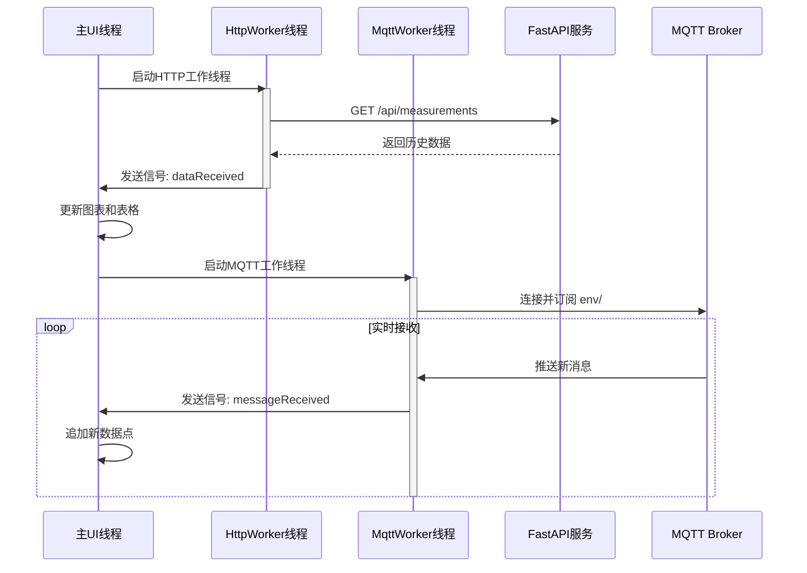

#### 6.5.2 信号与槽机制
发布端：`status_changed(metric, status)`、`output_received(metric, text)` → 更新按钮/日志。订阅端：`message_received(topic, data)` → 主线程刷新表格和图表；`connected`/`disconnected`/`error` → 弹窗或状态提示。

```python
class SubscriptionWidget(QWidget):
    def on_message_received(self, topic: str, data: dict):
        if topic != f"env/{self.metric}":
            return
        ts, value = data.get('ts'), data.get('value')
        if ts is None or value is None:
            return
        self.append_table_row(ts, value)
        self.update_chart_with_new_point(ts, value)
```

---

## 7. MQTT 协议与数据格式规范

### 7.1 Topic 主题设计
两层通道：ingest/*（原始）→ env/*（清洗后）。

**Topic 层次结构**：

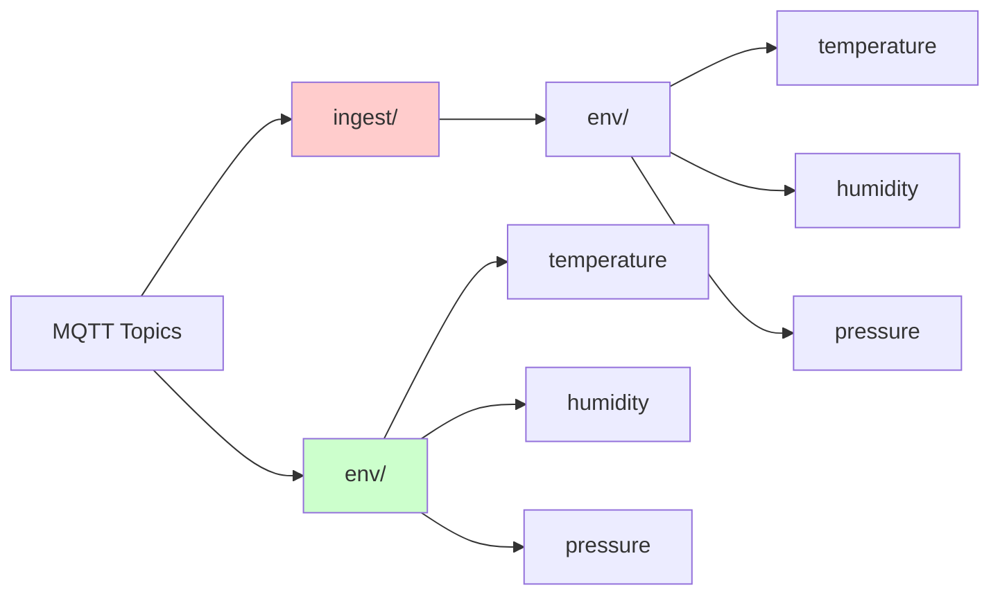

**命名约定**：小写、用 `/` 分层；不在主题中放客户隐私；避免通配符发布。

### 7.2 消息格式定义
统一 JSON：`{"ts": "YYYY-MM-DDTHH:MM:SS", "value": <number|null>}`，编码 UTF-8。

示例：

```json
{"ts": "2014-02-13T06:20:00", "value": 3.0}
```

**字段要求**：
- `ts`：ISO8601（UTC/本地均可，但保持一致），字符串。
- `value`：数字或 null；不携带单位，单位通过 metric 含义隐含（℃/%/hPa）。

### 7.3 数据转换规则
- Publisher：读取文件字符串，空字符串 → null，字符串数字 → float；发布到 `ingest/env/<metric>`。
- Gateway Proxy：验证 JSON、必需字段、ISO8601，清洗 value（空串/null→null，数字字符串→数字），去重后转发到 `env/<metric>`。
- Collector：订阅 `env/#`，直接入库 SQLite；保留 null 作为缺失值。

---

## 8. 系统部署与运行

### 8.1 环境准备

#### 8.1.1 系统要求

跨平台支持（Linux/macOS/Windows）

#### 8.1.2 依赖安装
Python 3.9+；安装依赖：

```bash
pip install -r A-deploy/iot-project/deploy/proxy/requirements.txt
pip install -r C-collector/requirements.txt
pip install -r D-ui/requirements.txt
```

### 8.2 部署步骤
1) 启动 Broker（A-deploy）：拷贝配置、生成密码、`systemctl start mosquitto`。
2) 启动 Gateway Proxy：`cd A-deploy/iot-project/deploy/proxy && python app/main.py`。
3) 启动 Collector：`cd C-collector && python collector.py`（若需 HTTP API，再 `uvicorn api:app --reload`）。
4) 启动 UI：`cd D-ui && python main.py`。
5) 通过 UI 或命令行启动 Publisher（B-publisher）。

### 8.3 启动顺序

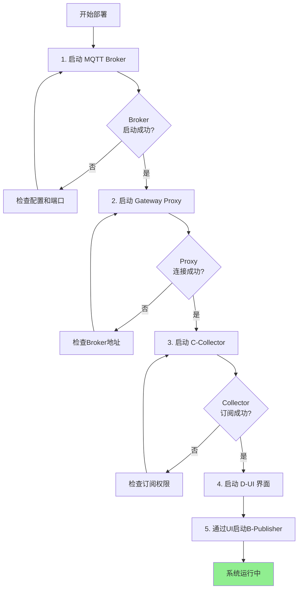

**启动顺序说明**：
先 Broker → Proxy → Collector → UI → Publisher；确保上游组件可用再启动下游，避免连接失败重试占用时间。

### 8.4 测试验证
用 mosquitto_pub/sub 验证 ACL；在 UI 订阅页确认实时曲线更新；调用 Collector `/api/realtime` 验证 HTTP 服务。

---

## 9. 问题与解决方案

### 9.1 遇到的技术难题

#### 问题 1: 数据库数据量少

**问题描述**：
初始验证时发布速率过低，导致样本不足。

**问题原因**：
Publisher 默认 1Hz，且仅跑了几分钟。

**解决方案**：
提升到 5–10Hz，或延长运行时间；确保 Proxy、Collector 正常。

#### 问题 2: MQTT 断连

**问题描述**：偶发网络抖动导致订阅端断连。

**解决方案**：MQTTSubscriber 已启用 loop_start 与自动重连；必要时增加超时时间、在 UI 提示重试。

### 9.2 解决方案
见上；核心是提高发布时长/速率、保证网络与 Broker 稳定、用 UI 观测链路状态。

### 9.3 系统优化
可选优化：
- Proxy 增加 metrics 白名单配置化、批量转发。
- Collector 增加批量入库与异步写。
- UI 增加数据导出、深色模式、告警阈值提示。

---

## 10. 项目总结

### 10.1 完成功能

本项目成功实现：完成 MQTT 链路（ingest→env）、数据验证清洗、发布/订阅、可视化与 API 查询。

### 10.2 技术亮点

1. **数据网关设计**：集中验证清洗+去重，隔离原始与官方数据。
2. **多线程与进程控制**：UI 使用 QThread + QProcess，避免阻塞。
3. **实时可视化**：MQTT + Matplotlib 实时更新，含日汇总。
4. **权限与两层 Topic**：ACL + ingest/env 分层，最小权限原则。

### 10.3 团队分工

| 姓名 | 学号 | 负责模块 | 主要工作 |
|------|------|----------|----------|
| 朱会佳 | 2353922 | A 模块 | Broker/ACL/Proxy 部署与配置 |
| 邱婉盈 | 2354275 | B 模块 | 发布脚本与速率控制 |
| 謝文軒 | 2350503 | C 模块 | Collector + API |
| 孙凯文 | 2356218 | D 模块 | PyQt UI、可视化 |

---

## 11. 附录

### 11.1 依赖库清单
核心三方：paho-mqtt、fastapi、uvicorn、sqlite3（内置）、PyQt5、matplotlib、requests。

### 11.2 配置文件说明
主要配置：`A-deploy/iot-project/deploy/broker/mosquitto-system.conf`、`acl`、Proxy `.env`、Publisher/Collector/UI 里的 broker 账号。强调保持与 ACL 一致。

### 11.3 API 接口文档
Collector FastAPI：`/api/realtime`、`/api/history`、`/api/stats`；Swagger at `/docs`。

### 11.4 参考资料

1. Eclipse Mosquitto 官方文档：https://mosquitto.org/
2. Paho MQTT Python Client：https://www.eclipse.org/paho/index.php?page=clients/python/index.php
3. FastAPI 官方文档：https://fastapi.tiangolo.com/
4. PyQt5 官方文档：https://www.riverbankcomputing.com/static/Docs/PyQt5/

